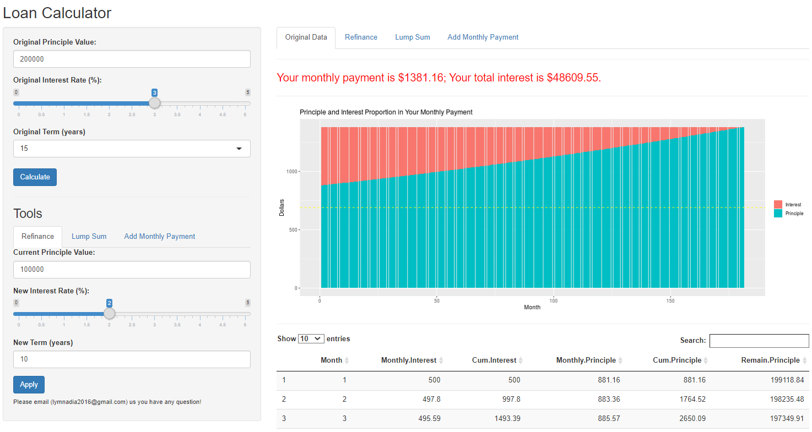

# LoanCalculator

## Access to the calculator [here](https://davidnadia.shinyapps.io/mortgage_calculator/)

* Our calculator provides functions/tools to answer the following questions: 
  * How much I need to pay monthly (interest and principle) given loan amount, interest rate and loan term? (Original Loan)
  * How much interest I can save from my original loan with current principal balance, new interest rate and new term? (Refinance)
  * How much interest and time I can save from my original loan with a Lump-Sum payment? (Lump-Sum Payment)
  * How much interest and time I can save from my original loan with additional monthly payment? (Additional Monthly Payment)

